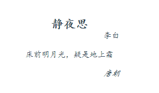
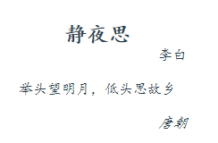
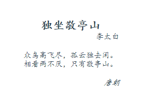

## Component slot 使用

* slot 允许你传入值或一段`html`，如下代码所示
* 我们创建一个古诗的组件，然后引入、显示

```html
comp-shi

  <div class="comp-shi">
    <div class="title">静夜思</div>
    <div class="author">李白</div>
    <div class="content"> 床前明月光，疑是地上霜</div>
    <div class="time">唐朝</div>
  </div>
  
引用：  

<comp-shi></comp-shi>
```



* 但是很明显，中间的诗句差了两句，如果能让引用者（父级）自定义内容，真是再好不过了

```html
comp-shi

  <div class="comp-shi">
    <div class="title">静夜思</div>
    <div class="author">李白</div>
    <div class="content">
      <slot></slot>
    </div>
    <div class="time">唐朝</div>
  </div>

引用：

<comp-shi> 举头望明月，低头思故乡 </comp-shi>
```



* 当父组件没有传递 `slot` 中的内容时，很明显页面显示时就会丢失内容，这个时候可以设置默认内容
* 当父组件传递了 `slot` 内容时，显示父组件的内容，不传递时，则显示组件的默认内容

```html
comp-shi

<div class="content">
  床前明月光，疑似地上霜
  <slot></slot>
</div>
```

* 当创建一个复杂的组件时，肯定在某些地方传递某些具名内容，这样的话，就要在组件的内部设定范围
* 同时，父组件引用时，也需要指定范围，这时候
* 使用 `<slot name='xxx'>` 及 `<template v-slot:xxx>` 能解决这个需求
* 以古诗的组件为例，将 `title` `author` 设置成可配置

```html
comp-shi:

<div class="comp-shi">
  <div class="title"><slot name="title"></slot></div>
  <div class="author"><slot name="author"></slot></div>
  <!--不指定[name=]属性的，默认default，也可以指定 name=default -->
  <div class="content"><slot></slot></div>
  <div class="time">唐朝</div>
</div>

引用：

<comp-shi>
  <template v-slot:title>独坐敬亭山</template>
  <template v-slot:author>李太白</template>
  众鸟高飞尽，孤云独去闲。相看两不厌，只有敬亭山。
</comp-shi>
```




* `v-slot:name`可以用 `#name` 代替，这是个语法糖，能同样出色完成工作 

#### 作用域插槽

* 此方法很有趣，具体查看代码

```html
comp-shi

<div class="content">
  <!--这里 info 的值是在子组件 comp-shi 内部定义的-->
  <!--将它绑定到子组件的属性上，告诉外部：我这里有个 info 的数据可以使用-->
  <slot :info="info"></slot>
</div>

<script>
const vue = {
  data () {
    return {
      info: { type: '古诗' }
    }
  }
}
</script>

引用：

<template #default="theDefault">
  众鸟高飞尽，孤云独去闲。相看两不厌，只有敬亭山。
  {{theDefault.info.type}}
</template>

```

* 这种方法在于，暴露了子组件的方法，给外部的父引用，据称是一种很有必要的使用方法
* 但是我个人没有找到合适的应用场景，同时我认为，保留子组件的纯净性很有必要，传递的方法最好是单向的
* 即 父传子，不过既然提供了此方法，就意味着真有可用的场景 

### 解构插槽

* 对于学习过 `ES6` 的同学来讲，下面的代码不会不熟悉
* `const obj = {i: 1, j: 2}`
* `const {i, j, h = 3} = obj`
* 因为你可以针对 **作用域解构** 来使用解构，使得代码更加简洁

```html
<template #default="theDefault">
  {{theDefault.info.type}}
</template>

==>
<template v-slot="{ info }">
  {{info.type}}
</template>

==> 也可以重新取个名字
<template v-slot="{ info: theInfo }">
  {{info.type}}
</template>

==> 甚至预付值
<template v-slot="{ info = {type: '词'} }">
  {{info.type}}
</template>
```

* 我感觉，这样是更加复杂了...


#### 更新：作用域插槽的使用

* 在上面的阐述上，我们一度断定作用域插槽没什么作用场景，或者说很难用（或者不符合常规开发技巧）
* 但官方给出个例子说明了其使用场景：

```html
==> 这是一个 todoList component
==> 如果这时候不把 todo 这个对象显露出去，父组件就不能控制显示什么，只能使用 todoList 中默认显示的内容 todo.txt
==> 但是一旦显露了 todo 对象，父组件就能按需显示
<div>
  <div v-for="todo in todoList" :key="todo.id">
    <slot>{{todo.txt}}</slot>
  </div>
</div>

<div>
  <div v-for="todo in todoList" :key="todo.id">
    <slot :todo="todo">{{todo.txt}}</slot>
  </div>
</div>

引用：
<todo-list #default="{todo}">{{todo.complete ? todo.txt : ''}}</todo-list>

```
