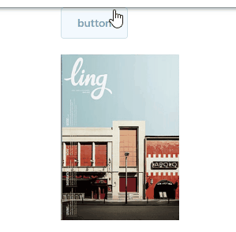

## 动画与过渡效果

* 这是一个入门简单，精通较难的一个点。
 
#### 过渡

* 通过简单的设置代码实现淡入淡出动画
* 通过设置 v-if/v-show/动态组件/组件根节点的设置，能实现过渡

```html
<transition name="fade">
  <div v-if="show"></div>
</transition>
```

```scss
.fade-enter-active, .fade-leave-active {
  transition: opacity .5s;
}
.fade-enter, .fade-leave-to /* .fade-leave-active below version 2.1.8 */ {
  opacity: 0;
}
```

**实例**




* 实际上 `fade-enter-active/fade-leave-active` 是在过渡期间持续生效的
* 而`fade-enter`是进入的**第一刻**生效，**第二刻**移除
* `fade-enter-to`是进入的**第二刻**生效，完成后移除
* 而`fade-leave`是离开的**第一刻**生效，**第二刻**移除
* `fade-enter-to`是离开的**第二刻**生效，完成后移除
* 而基本上还存在一个静态的状态。故状态的切换应是：
* `fade-enter` 过渡到 `fade-enter-to` 一帧切换成 **静态状态**，`fade-leave` 过渡到 `fade-leave-to` 一帧切换成 **隐藏状态**
* `fade-enter-active/fade-leave-active` 决定了过渡的效果、时间。

下面这个例子清楚地描述了整个状态的切换：

```scss
.ani-exp-div-2 {
  width: 300px;
  height: 200px;
  background-color: orange;
}

.fade2-enter {
  width: 50px;
  height: 10px;
  background-color: #ff00ff;
}
.fade2-enter-to {
  width: 500px;
  height: 300px;
  background-color: blue;
}
.fade2-enter-active {
  transition: all 2s;
}

.fade2-leave {
  background-color: black;
  opacity: 1;
  width: 100px;
  height: 50px;
}
.fade2-leave-to {
  opacity: 1;
  background-color: red;
  width: 20px;
  height: 10px;
}
.fade2-leave-active {
      transition: all 2s cubic-bezier(1.0, 0.5, 0.8, 1.0);
    }
```

**实例**


#### 动画

* css动画同过渡一样，只是在`enter-active` `leave-active`中定义 `animation`动画
* 从代码可知，通过`@keyframe`定义动画并引用，即可完成效果

```scss
  .ani-exp-div-3 {
      width: 300px;
      height: 200px;
      background-color: orange;
    }
    .ani1-enter-active {
      animation: bounce-in 1s;
    }
    .ani1-leave-active {
      animation: bounce-in 1s reverse;
    }
    @keyframes bounce-in {
      0% {
        transform: scale(0);
      }
      50% {
        transform: scale(1.5);
      }
      100% {
        transform: scale(1);
      }
    }
```

**实例**


#### 自定义类名（与第三方动画库结合）

* 诸如像：`enter-class`可以自定义过滤类名，并可结合使用第三方动画
* 下面的例子使用自定义类名，并结合`animate.css`来使用

```html
<transition
    enter-active-class="animated tada"
    leave-active-class="animated bounceOutRight"
  >
    <div class='ani-exp-div-4' v-if="show4">???</div>
  </transition>
```

```scss
@import "./animate.css.scss"; // 注意，在animate.css最新的代码中有一段代码指定了过渡时间为1ms，请根据实际情况屏蔽
```


#### 列表过渡

* 使用`<transition-group>`实现列表过渡，`transition-group`元素默认会转化成`span`，可通过`tag`来修改
* 列表过渡在现实的业务中有更多的可呈现性。
* 查看代码可知，其中的依赖 `transition-group`

```html
<transition-group name='list1' tag='p'>
  <span v-for="(o, i) in list1" :key="o" class="list-item">
    {{o}}
  </span>
</transition-group>
```


